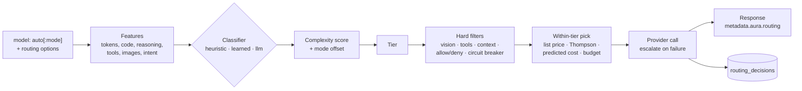
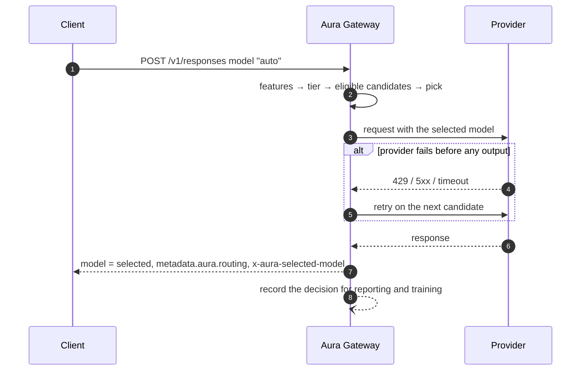
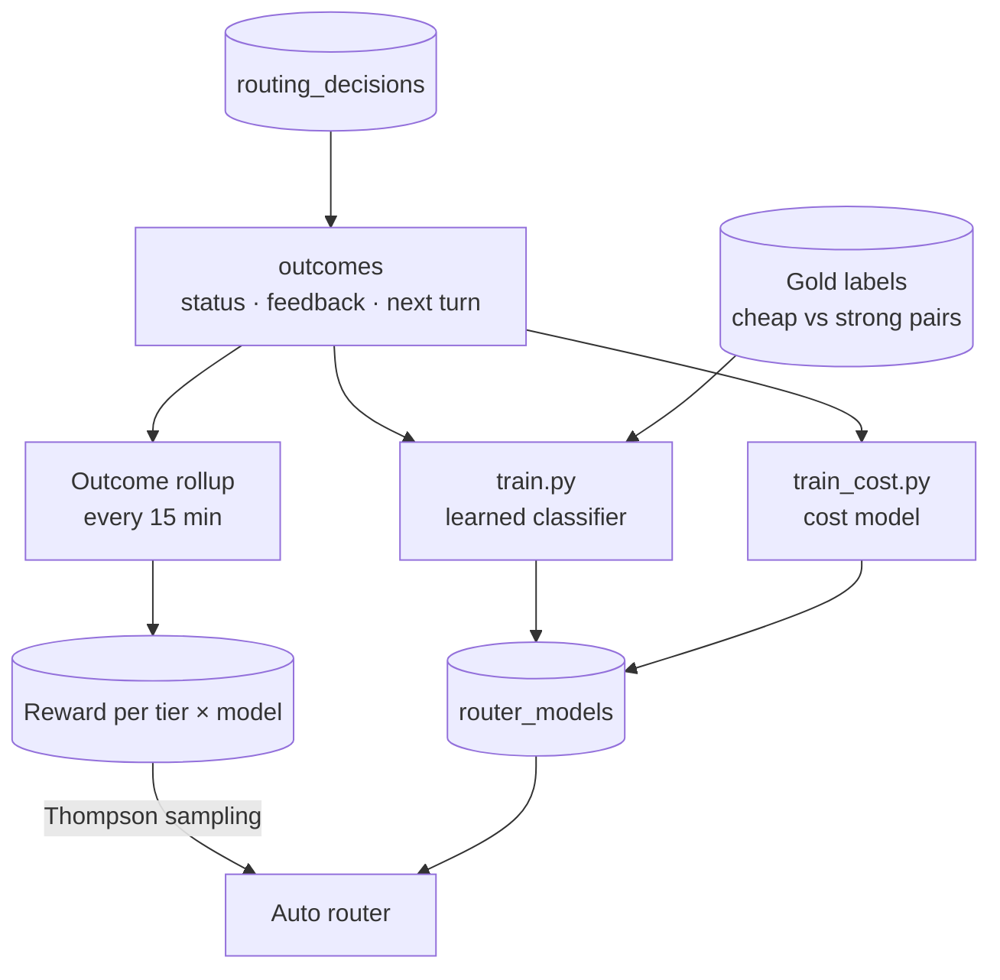

# Auto Model Routing

Send `model: "auto"` and Aura scores the request's complexity, maps it to a tier, and dispatches to the cheapest healthy model in that tier. Every response says which model answered and why, so you can audit the decision and tune it.

```json
{
  "model": "auto",
  "input": "What is the capital of France?"
}
```

```json
{
  "model": "gemini-3.1-flash-lite",
  "metadata": {
    "aura": {
      "routing_strategy": "auto:simple",
      "routing": {
        "tier": "simple",
        "score": 0.04,
        "selected": "gemini-3.1-flash-lite",
        "reason": "cheapest eligible in simple ($0.11/1M blended)"
      }
    }
  }
}
```

## Tiers

| Tier | Typical request | Default candidates |
|------|-----------------|--------------------|
| `simple` | Short factual questions, rewrites, translations, greetings | `gemini-3.1-flash-lite`, `gemini-3.5-flash`, `gpt-5.6-luna` |
| `medium` | Everyday assistant work, light code, tool calls | `gemini-3.8-flash`, `gpt-5.4-mini`, `claude-haiku-4-5` |
| `complex` | Multi-step engineering work, debugging, long context | `claude-sonnet-5`, `gemini-3-pro-preview`, `gpt-5.6-terra` |
| `reasoning` | Proofs, derivations, deep analysis, explicit "think hard" | `claude-opus-5`, `gpt-5.6-sol`, `claude-fable-5-1` |

Only models the gateway can actually serve are considered. Tier lists are configurable per gateway, and an organization can narrow them with allow / deny lists and tier clamps; when none are configured the gateway derives them from its model catalog at startup.

## How a decision is made



1. **Features.** The gateway extracts a numeric feature vector from the request: estimated tokens, code and reasoning markers, tool count, images, conversation shape, explicit hints such as "quick answer" or "think carefully". No prompt text is stored.
2. **Classifier.** The default heuristic scorer weighs those features into a complexity score in `[0, 1]`. A learned classifier trained on your own traffic, or an LLM classifier, can replace it per request or per organization.
3. **Mode.** `auto:cost` and `auto:quality` shift the score down or up before it is mapped to a tier; `auto` (balanced) leaves it alone.
4. **Hard filters.** Models that cannot serve the request are dropped: no vision for image input, no tool support when tools are present, context window too small, excluded by `allow` / `deny`, or tripped a circuit breaker after recent failures.
5. **Within-tier pick.** Among the eligible models in the tier the gateway picks by list price, by learned reward (Thompson sampling), or by the predicted cost of *this* request, and honours a per-request `max_cost_usd` budget.
6. **Escalation.** If the provider fails before producing output the request is retried on the next candidate, then the next tier up.



## Modes and options

| Model string | Effect |
|--------------|--------|
| `auto` | Balanced: the tier the classifier picks. |
| `auto:cost` | Nudges borderline requests to the cheaper tier. |
| `auto:quality` | Nudges borderline requests to the stronger tier. |

The `routing` object refines a request:

```json
{
  "model": "auto",
  "input": "...",
  "routing": {
    "mode": "quality",
    "min_tier": "medium",
    "max_tier": "complex",
    "allow": ["claude-*", "gpt-*"],
    "deny": ["*-preview"],
    "max_cost_usd": 0.01,
    "sticky": true
  }
}
```

| Option | Meaning |
|--------|---------|
| `mode` | `cost`, `balanced` or `quality`; same as the `auto:<mode>` suffix. |
| `min_tier` / `max_tier` | Clamp the tier the router may choose. |
| `allow` / `deny` | Glob patterns on model ids; deny wins. |
| `max_cost_usd` | Skip candidates whose predicted cost for this request exceeds the budget (needs the learned cost model). |
| `sticky` | Keep the previous turn's model inside a tool loop (default `true`). |
| `classifier` | `heuristic`, `learned` or `llm` for this request. |

Organizations can set the same options as defaults or limits in their settings, so a team can cap every request at `max_tier: medium` or deny a provider without touching client code.

## Reading the decision

`metadata.aura.routing` carries the full decision:

| Field | Meaning |
|-------|---------|
| `score` | Complexity in `[0, 1]` after the mode offset. Boundaries are 0.15 / 0.35 / 0.60. |
| `classified_tier` / `tier` | Tier the classifier assigned, and the tier after clamps and the tools floor. |
| `signals` | Weighted feature contributions that fired. |
| `hard_filters` | Constraints that shaped the decision, in order. |
| `candidates` | Every model considered with eligibility, list price and, when a cost model is active, `predicted_cost_usd`. |
| `selected` / `reason` | The winner and why, including escalations. |
| `options` | The routing options the gateway applied: the request's `routing` merged with any organization override. Absent when none were sent. |
| `shadow` | `true` when the request pinned a model and the router only recorded what it would have done. |

The playground shows the same decision on every answer: click the **auto · tier · model** chip under a response to open the routing inspector with the score bar, signals, candidates and reason.

To try it there, pick **Auto (balanced / cost / quality)** from the model picker. An **Auto** chip appears next to the other strategy chips with the request options: mode, min and max tier, classifier, per-request budget, and sticky tool loops. Pick a concrete model to turn the router off again; its answers then carry an amber **shadow** chip showing what auto would have done. Compare mode puts auto and a pinned model side by side on the same prompt.

## Shadow mode

Requests that pin a concrete model are still scored by default. The decision `auto` would have made is returned with `"shadow": true`, the request is sent to the model you asked for, and the admin dashboard reports the estimated savings. This lets you evaluate the router on real traffic before switching anything over.

## Learning from your traffic

Every decision is stored (numeric features only) and joined with what actually happened: request status, tokens, cost, latency, explicit feedback, and whether the user moved on, retried, or corrected the model on the next turn. From that the gateway learns without any labelling work:



| Piece | What it learns |
|-------|----------------|
| **Outcome rewards** | Each decision gets a reward from the traces: success and the user moving on is good; a retry, a correction, an escalation to a stronger model, or a thumbs-down is bad. |
| **Thompson sampling** | Per (tier, model) win/loss statistics; models that keep users moving on win more traffic while new models still get explored. |
| **Gold labels** | A small sample of requests is answered by both the cheapest and the strongest tier and judged, giving ground truth for the classifier. |
| **Learned classifier** | A logistic-regression tier classifier trained on gold labels and outcomes, calibrated to a target share of strong-model traffic. |
| **Cost model** | Predicts how long each model's answer will be for this request, so candidates are ranked and budgeted by the cost of *this* request rather than static list price. |

Models are trained with the scripts in `scripts/router/`, pushed through the admin API, and can be activated, reloaded or rolled back without a restart.

## Admin and monitoring

| Endpoint | Description |
|----------|-------------|
| `GET /admin/stats/routing/auto?period=24h` | Applied and shadow decisions, cost, estimated savings, per-tier and per-model breakdowns, recent decisions. |
| `GET /admin/routing/decisions/{response_id}` | One decision by request or response id. |
| `POST /admin/routing/score` | Dry-run the router on a request body without dispatching. |
| `GET /admin/routing/arms` | Learned per (tier, model) statistics. |
| `GET` / `POST /admin/routing/models` | Stored classifiers and cost models; upload, activate, reload, deactivate. |

Prometheus metrics: `aura_routing_decisions_total{mode,tier,classifier,model,shadow}`, `aura_routing_classifier_seconds{classifier}`, `aura_routing_failures_total{reason}`, `aura_routing_escalations_total{from_tier,to_tier,error_type}`.

## SDKs

Both SDKs pass the model string through unchanged; use `KnownModels.AUTO`, `KnownModels.AUTO_COST` or `KnownModels.AUTO_QUALITY`.

```python
from aura import AuraClient, KnownModels

client = AuraClient(api_key="...")
response = client.responses.create(model=KnownModels.AUTO, input="What is the capital of France?")
print(response.model, response.metadata["aura"]["routing"]["tier"])
```

```typescript
import { AuraClient, KnownModels } from 'aura-llm'

const client = new AuraClient({ apiKey: '...' })
const response = await client.responses.create({ model: KnownModels.AUTO, input: 'What is the capital of France?' })
console.log(response.model, response.metadata?.aura?.routing?.tier)
```

The full reference, including gateway configuration, per-organization overrides, error codes and the training loop, is in `docs/api/auto-routing.md` in the repository.
